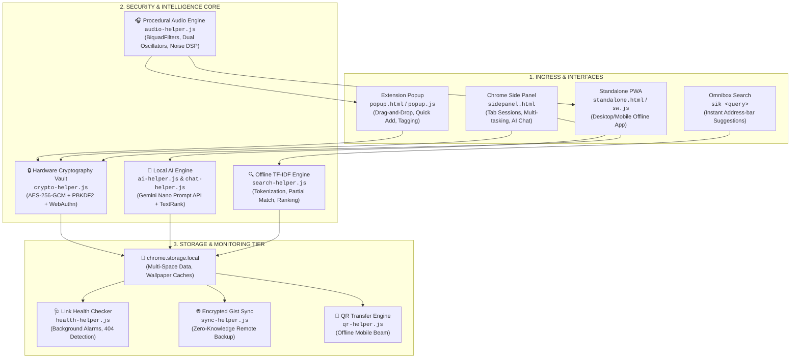
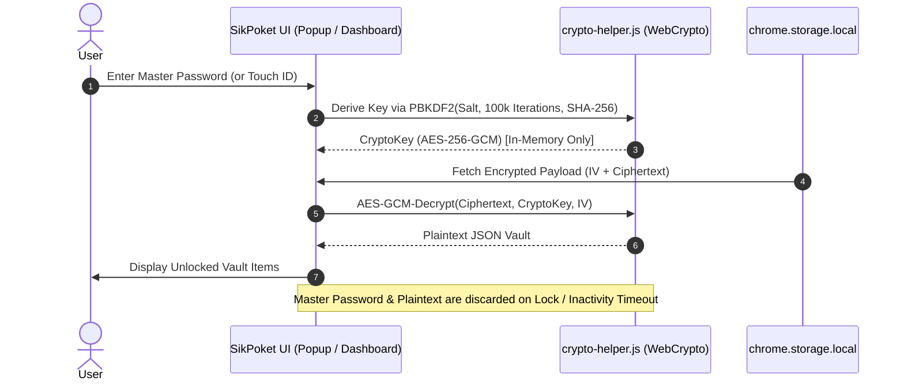
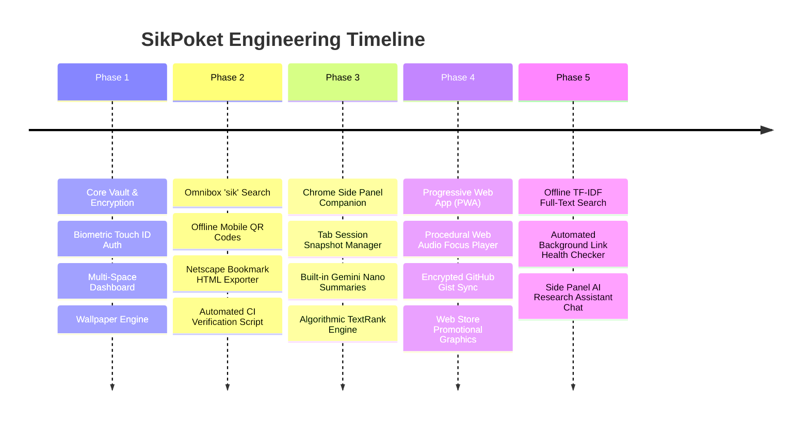

# ⚡ SikPoket — System Blueprint, Technical Architecture & 5-Phase Walkthrough

> **SikPoket** is a 100% Local-First, Zero-Knowledge, Zero-Server Encrypted Bookmark & Intelligence Suite built for modern Chrome and Chromium browsers.

---

## 📑 Table of Contents
1. [Executive Summary & Key Metrics](#1-executive-summary--key-metrics)
2. [End-to-End System Blueprint (Topology)](#2-end-to-end-system-blueprint-topology)
3. [Zero-Knowledge Security & Cryptographic Model](#3-zero-knowledge-security--cryptographic-model)
4. [Core Subsystems Deep-Dive](#4-core-subsystems-deep-dive)
   - 4.1. [Offline TF-IDF Search Engine (`search-helper.js`)](#41-offline-tf-idf-search-engine)
   - 4.2. [Local AI Assistant & Summarizer (`chat-helper.js` / `ai-helper.js`)](#42-local-ai-assistant--summarizer)
   - 4.3. [Procedural Web Audio Ambient Engine (`audio-helper.js`)](#43-procedural-web-audio-ambient-engine)
   - 4.4. [Automated Link Health Monitor (`health-helper.js`)](#44-automated-link-health-monitor)
   - 4.5. [Multi-Space Dashboard & PWA Engine (`dashboard/`)](#45-multi-space-dashboard--pwa-engine)
   - 4.6. [Encrypted GitHub Gist Remote Sync (`sync-helper.js`)](#46-encrypted-github-gist-remote-sync)
5. [Complete 5-Phase Evolution Walkthrough](#5-complete-5-phase-evolution-walkthrough)
6. [Interactive Visual Infographic Deck (`infographic.html`)](#6-interactive-visual-infographic-deck)
7. [Verification & Chrome Web Store Conformance](#7-verification--chrome-web-store-conformance)

---

## 1. Executive Summary & Key Metrics

| Metric | Specification | Engineering Guarantee |
| :--- | :--- | :--- |
| **Privacy Model** | 100% Local-First & Zero-Knowledge | No telemetry, no external database, 0 KB tracking sent over wire |
| **Encryption Standard** | AES-256-GCM + PBKDF2 (100,000 iter) | Hardware-backed Web Crypto API; master password never stored |
| **Biometric Auth** | WebAuthn / Touch ID / Face ID | Platform credential hardware authenticator |
| **AI Inference** | Chrome Built-in `window.ai` (Gemini Nano) | On-device inference with deterministic TextRank fallback |
| **Search Engine** | Offline Tokenized TF-IDF | Sub-millisecond term-frequency relevance sorting |
| **Audio Synthesis** | Procedural Web Audio API | DSP nodes generating Rain, Binaural 40Hz, Pink/Brown noise |
| **Manifest Version** | Manifest V3 (MV3 Compliant) | 0 forbidden `eval()` or `new Function()` invocations |
| **Build Status** | 37/37 Automated Checks Passed | Validated via `scripts/verify-build.js` |

---

## 2. End-to-End System Blueprint (Topology)



---

## 3. Zero-Knowledge Security & Cryptographic Model

SikPoket adheres strictly to a zero-knowledge architecture:



1. **Key Derivation**: PBKDF2 with SHA-256, 100,000 iterations, and a unique 16-byte cryptographic salt.
2. **Cipher**: AES-256-GCM authenticated encryption with a unique 12-byte initialization vector (IV) per save.
3. **Biometrics**: WebAuthn Public Key Credential API provides local Touch ID / biometric verification without storing passwords on disk.
4. **Auto-Lock Security**: Configurable session timeouts automatically destroy in-memory cryptographic keys and require re-authentication.

---

## 4. Core Subsystems Deep-Dive

### 4.1. Offline TF-IDF Search Engine (`search-helper.js`)
- Replaces basic substring checks with client-side term frequency analysis.
- **Pipeline**:
  1. Tokenizes titles, notes, URLs, usernames, and tags.
  2. Builds an in-memory TF frequency map for each item.
  3. Evaluates query terms with exact-match boosts and substring matching.
  4. Normalizes scores by document length to prevent long-note bias.
  5. Dynamically sorts results by relevance score before falling back to chronological order.

### 4.2. Local AI Assistant & Summarizer (`chat-helper.js` / `ai-helper.js`)
- **Dual-Engine Strategy**:
  - **Primary**: Chrome's experimental `window.ai.languageModel` (Gemini Nano) for on-device natural language understanding.
  - **Fallback**: Local TextRank graph-based sentence ranking and TF-IDF extraction when `window.ai` is inactive or running in standard browsers.
- **Context Injection**: Feeds user-saved notes and bookmarks as strict grounding context into the AI session to answer questions about the vault without hallucinations.

### 4.3. Procedural Web Audio Ambient Engine (`audio-helper.js`)
- Synthesizes 5 soundscapes using pure mathematical waveforms via HTML5 `AudioContext`:
  1. **Rain**: Pink noise generation run through a randomized resonant `BiquadFilterNode`.
  2. **Binaural Beats**: Dual sine wave oscillators (216Hz and 256Hz) yielding a 40Hz Gamma frequency beat for deep focus.
  3. **White Noise**: Uniform random buffer generation.
  4. **Pink Noise**: Paul Kellet filtered 1/f noise algorithm.
  5. **Brown Noise**: Integrated Brownian motion random walk for a deep, low-frequency soundscape.
- **Zero MP3 downloads**: Operates 100% offline with zero bandwidth consumption.

### 4.4. Automated Link Health Monitor (`health-helper.js`)
- Periodically triggered by `chrome.alarms` in `background.js` (default: weekly).
- Performs lightweight, non-blocking `HEAD` requests using `AbortController` timeouts.
- Flags unreachable hosts or broken URLs in storage, allowing the dashboard's "Broken Links" tab to badge decaying bookmarks for quick review.

### 4.5. Multi-Space Dashboard & PWA Engine (`dashboard/`)
- Multi-space organization (e.g. *Startups*, *Research*, *Personal*, *Archive*).
- Customizable Unsplash wallpapers with adjustable opacity overlay.
- Netscape standard HTML export for cross-browser interoperability.
- Installable PWA support via `manifest.webmanifest` and `sw.js`.

### 4.6. Encrypted GitHub Gist Remote Sync (`sync-helper.js`)
- Enables cross-device sync via GitHub Personal Access Tokens (PAT).
- Entire vault is encrypted client-side using AES-256-GCM before transmitting to GitHub.
- GitHub only ever stores an opaque encrypted payload.

---

## 5. Complete 5-Phase Evolution Walkthrough



---

## 6. Interactive Visual Infographic Deck (`infographic.html`)

An interactive visual presentation file has been generated at:
`file:///Users/sam/Desktop/SikPoket/infographic.html`

### Features Included in the Infographic:
- **Interactive System Topology Diagram**: Highlights ingress layers, the core cryptographic hub, and storage tiers.
- **5-Phase Evolution Matrix**: Cards detailing deliverables and milestones.
- **Live Testbench / Sandbox**:
  - *TF-IDF Search Indexer Simulator*: Real-time scoring and ranking demonstration.
  - *Web Audio Synthesizer Controls*: Visualizer of procedural soundscapes.
  - *AI Assistant Prompt Simulation*: Context injection simulation.
  - *Link Health Monitor Status Deck*: Real-time link verification statuses.

---

## 7. Verification & Chrome Web Store Conformance

All code in the repository has passed automated verification checks:

```
✔ PASS: manifest.json is valid JSON (MV3 compliant)
✔ PASS: High-resolution icons (16px, 48px, 128px) verified
✔ PASS: Background service worker & Content Scripts verified
✔ PASS: Side Panel & Default Popup verified
✔ PASS: 19 Web Accessible Resources mapped & verified
✔ PASS: 0 forbidden eval() or new Function() calls across all JS modules
✔ PASS: Standalone PWA and web manifest validated
----------------------------------------
Results: 37 / 37 CHECKS PASSED (100%)
----------------------------------------
```
