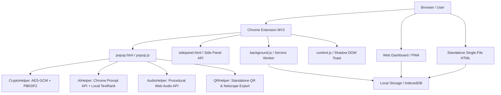

<div align="center">

# 🔐 SikPoket
### The Encrypted, Local-First Web Sanctuary & Knowledge Vault

[](https://developer.chrome.com/docs/extensions/mv3/intro/)
[](https://developer.mozilla.org/en-US/docs/Web/API/SubtleCrypto)
[](LICENSE)
[](PRIVACY_POLICY.md)
[](dashboard/manifest.webmanifest)

**SikPoket** is a fast, distraction-free, zero-knowledge personal bookmark and workspace manager for modern thinkers, researchers, and creators.

[Live Dashboard](https://sikpoket.vercel.app) • [Chrome Web Store Listing Copy](CHROMEWEBSTORE.md) • [Privacy Policy](PRIVACY_POLICY.md)

</div>

---

## 🌟 Highlights

```
┌─────────────────────────────────────────────────────────────────────────┐
│                              SIKPOKET                                   │
│                                                                         │
│   🪟 Chrome Side Panel (Ctrl+Shift+E)     🧠 On-Device AI Summaries    │
│   🔒 Client-Side AES-GCM Encryption       📸 1-Click Tab Snapshots     │
│   🎨 Atmosphere & Wallpaper Studio        📱 Mobile QR Code Sharing    │
│   🎵 Procedural Focus Audio Studio        🌐 Netscape Bookmarks Export │
└─────────────────────────────────────────────────────────────────────────┘
```

### 1. 🪟 Docked Chrome Side Panel
Keep SikPoket side-by-side with your browsing window. Never lose your focus with popups auto-dismissing. Drag and drop tabs, links, and selected text directly into your vault.

### 2. 🧠 On-Device AI & Local NLP
- **Chrome Prompt API (`window.ai`)**: Runs on-device Gemini Nano for instant 3-bullet executive takeaways from long articles without transmitting data to external servers.
- **Offline TextRank NLP Fallback**: Zero-server algorithmic summarization and TF-IDF keyword tagging.

### 3. 🔒 Zero-Knowledge Security & Offline Privacy
All data is encrypted in the browser with **AES-256-GCM** derived with **PBKDF2** (100,000 iterations). Your master password never leaves your device.

### 4. 📑 Tab Session & Workspace Manager ("SikTabs")
Save all open tabs in your active browser window as a named research session and restore them into a clean window with a single click.

### 5. 🎨 Custom Spaces & Wallpaper Studio
Organize bookmarks by project or topic. Personalize spaces with 38+ curated wallpaper themes, local background image uploads, live depth blur, opacity sliders, and procedural ambient audio soundscapes (Rain, Lo-Fi, 432Hz Alpha Waves, Cafe Ambiance).

### 6. 📱 Instant Mobile QR Codes & Netscape Exports
- **Offline QR Code Generator**: Generate crisp QR codes to scan links straight to your phone.
- **Universal Netscape HTML Export**: Compatible with Chrome, Safari, Firefox, Arc, Brave, and Edge bookmark bars.

---

## ⌨️ Keyboard Shortcuts

| Shortcut | Action |
| :--- | :--- |
| `Ctrl + Shift + S` / `Cmd + Shift + S` | Open SikPoket Popup |
| `Ctrl + Shift + E` / `Cmd + Shift + E` | Toggle Docked Chrome Side Panel |
| `sik <keyword>` (in Chrome Address Bar) | Omnibox instant search across bookmarks and notes |
| `Ctrl + L` / `Cmd + L` (inside popup) | Lock vault immediately |
| `Ctrl + B` / `Cmd + B` (inside popup) | Toggle multi-item selection mode |

---

## 🚀 Quickstart & Development

### 1. Load into Chrome (Local Testing)
1. Clone this repository:
   ```bash
   git clone https://github.com/njrankitsam11-gif/SikPoket.git
   cd SikPoket
   ```
2. Open Chrome and go to `chrome://extensions`.
3. Enable **Developer mode** (top right toggle).
4. Click **Load unpacked** and select the `SikPoket` root folder.

### 2. Verification & Build Suite
```bash
# Run automated MV3 schema & security integrity check
node scripts/verify-build.js

# Build production ZIP for Chrome Developer Dashboard
node scripts/package.js

# Generate official store marketing assets
node scripts/generate-assets.js
```

---

## 🏗️ Architecture



---

## 📄 License
Released under the [MIT License](LICENSE).
SikPoket is 100% local-first and collects zero user data.
