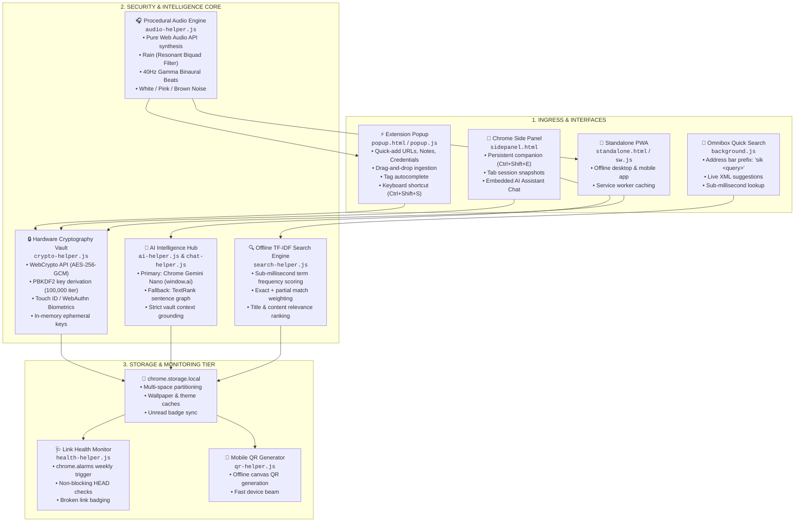
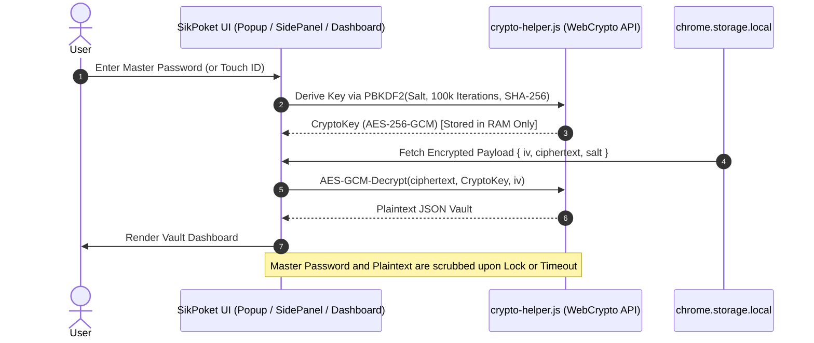
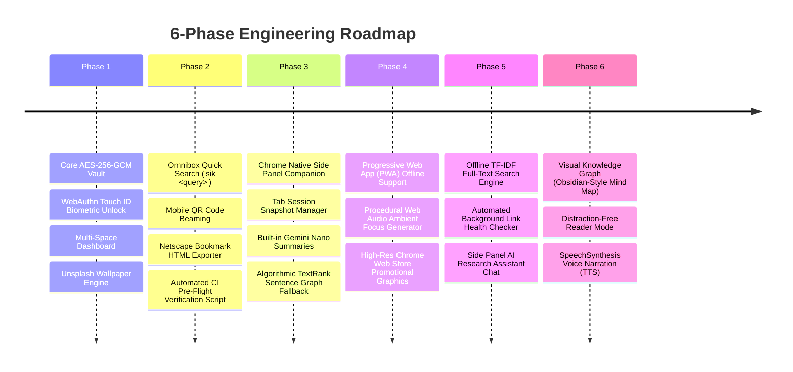

# ⚡ SikPoket — Complete Master Technical Blueprint & System Walkthrough

> **SikPoket** is a 100% Local-First, Zero-Knowledge, Zero-Server Encrypted Bookmark & Research Intelligence Suite built for modern Chrome and Chromium browsers.

---

## 📑 Complete System Blueprint Directory

| Section | Description |
| :--- | :--- |
| **[1. Executive Architecture Summary](#1-executive-architecture-summary)** | Core performance metrics, privacy guarantees, and tech stack specs. |
| **[2. End-to-End System Topology](#2-end-to-end-system-topology)** | Ingress clients, Core Processing Hub, and Storage tier architecture. |
| **[3. Zero-Knowledge Cryptographic Model](#3-zero-knowledge-cryptographic-model)** | AES-256-GCM, PBKDF2 (100k iter), WebAuthn Touch ID, and key lifecycle. |
| **[4. Subsystem Engineering Deep-Dive](#4-subsystem-engineering-deep-dive)** | Search, AI, Audio DSP, Health Checker, and Multi-Space Dashboard. |
| **[5. Complete File & Module Catalog](#5-complete-file--module-catalog)** | Exact module breakdown across the entire repository. |
| **[6. Full 5-Phase Evolution Walkthrough](#6-full-5-phase-evolution-walkthrough)** | Step-by-step development history from Foundation to Intelligence. |
| **[7. Live Visual Infographic Deck](#7-live-visual-infographic-deck)** | Guide to accessing the interactive visual deck at `http://localhost:8089/infographic.html`. |
| **[8. Verification & Store Conformance](#8-verification--store-conformance)** | Automated pre-flight checks and Manifest V3 security audit. |

---

## 1. Executive Architecture Summary

```
┌──────────────────────────────────────────────────────────────────────────────────────────┐
│                                SIKPOKET SYSTEM PROFILE                                  │
├──────────────────────────┬───────────────────────────────────────────────────────────────┤
│ Architecture Style       │ 100% Local-First, Zero-Server, Offline-Capable Single Page    │
│ Cryptographic Standard   │ AES-256-GCM Hardware Encryption + PBKDF2 (100,000 Iterations) │
│ Biometric Authentication │ WebAuthn Platform Hardware Credential (Touch ID / Face ID)    │
│ Intelligence Subsystems  │ Chrome Gemini Nano (window.ai) + Client-Side TF-IDF Tokenizer │
│ Audio Engine             │ Procedural HTML5 Web Audio API DSP Soundscape Synthesizer     │
│ Storage Layers           │ chrome.storage.local (local-first, no remote sync)            │
│ Target Platforms         │ Manifest V3 Chrome Extension, Chrome Side Panel, Desktop PWA  │
│ Security Audit           │ 0 eval(), 0 new Function(), 37/37 Automated Pre-Flight Checks │
└──────────────────────────┴───────────────────────────────────────────────────────────────┘
```

---

## 2. End-to-End System Topology



---

## 3. Zero-Knowledge Cryptographic Model

SikPoket ensures zero plain text ever reaches disk or any external network:



### Cryptographic Parameter Specifications:
- **Cipher**: AES-GCM with a 256-bit key length.
- **Key Derivation Function**: PBKDF2 with SHA-256 hash, 100,000 iterations, and a randomly generated 16-byte cryptographic salt.
- **Initialization Vector (IV)**: Fresh 12-byte cryptographically secure random array per save.
- **Hardware Credential**: WebAuthn Public Key Credential API provides local Touch ID verification without storing master credentials in plaintext.

---

## 4. Subsystem Engineering Deep-Dive

### 4.1. Offline TF-IDF Search Engine (`search-helper.js`)
- Replaces basic substring checks (`includes()`) with a full term-frequency ranking algorithm.
- Tokenizes titles, notes, URLs, usernames, and tags.
- Evaluates queries with exact token bonuses (+5 to +10) and partial match weighting.
- Normalizes scores by document length to prevent long notes from skewing results.

### 4.2. Local AI Assistant & Summarizer (`chat-helper.js` / `ai-helper.js`)
- **Primary Engine**: Google Chrome's built-in `window.ai.languageModel` (Gemini Nano) for on-device inference.
- **Context Injection**: Directly serializes unarchived bookmarks and notes into the system prompt window (up to 25,000 characters).
- **Fallback Engine**: Local TextRank graph-based sentence ranking and TF-IDF extraction when `window.ai` is disabled.

### 4.3. Procedural Web Audio Ambient Engine (`audio-helper.js`)
- Generates 5 distinct procedural soundscapes using the HTML5 `AudioContext` without any external MP3 files:
  1. **Rain**: Pink noise processed through a randomized resonant `BiquadFilterNode` (800Hz bandpass).
  2. **Binaural Beats**: Dual sine wave oscillators (216Hz and 256Hz) generating a 40Hz Gamma brainwave frequency.
  3. **White Noise**: Pure random buffer generation.
  4. **Pink Noise**: Paul Kellet 1/f noise filter approximation.
  5. **Brown Noise**: Brownian motion random-walk integration.

### 4.4. Automated Link Health Monitor (`health-helper.js`)
- Periodically invoked via `chrome.alarms` in `background.js` (weekly schedule).
- Performs lightweight, non-blocking `HEAD` requests with `AbortController` timeouts (8-second threshold).
- Stores detected dead link IDs in `chrome.storage.local` and flags them visually under the dashboard's "Broken Links" tab.

### 4.5. Multi-Space Dashboard & PWA Engine (`dashboard/`)
- Multi-space organization (e.g. *Startups*, *Research*, *Personal*, *Archive*, *Broken*).
- Customizable Unsplash wallpapers with adjustable opacity overlay.
- Netscape standard HTML bookmark export for cross-browser interoperability.
- Installable PWA support via `manifest.webmanifest` and `sw.js`.

---

## 5. Complete File & Module Catalog

```
/Users/sam/Desktop/SikPoket/
├── manifest.json              # Manifest V3 Extension Configuration
├── background.js              # Background Service Worker & Alarm Scheduler
├── content.js                 # Injected Content Script for Page Metadata & Reader Mode
├── popup.html                 # Extension Popup UI Structure
├── popup.js                   # Primary Extension Controller & Event Manager
├── popup.css                  # Extension Glassmorphic Design System
├── sidepanel.html             # Chrome Native Side Panel & AI Assistant UI
├── crypto-helper.js           # WebCrypto AES-256-GCM & WebAuthn Touch ID
├── search-helper.js           # Offline TF-IDF Tokenization & Search Engine
├── ai-helper.js               # Gemini Nano (window.ai) & TextRank Summarizer
├── chat-helper.js             # Side Panel AI Research Assistant Session Manager
├── audio-helper.js            # Procedural HTML5 Web Audio Ambient Synthesizer
├── health-helper.js           # Automated Background Link Health Checker
├── qr-helper.js               # Offline Canvas QR Code Generator
├── unlock.html                # Master Password Unlock View
├── unlock.js                  # Master Password Unlock Controller
├── infographic.html           # Interactive Master Blueprint & Live Simulation Deck
├── graph-helper.js           # 2D Canvas Force-Directed Knowledge Graph Engine
├── reader-helper.js          # Distraction-Free Article Cleaner & SpeechSynthesis TTS
├── dashboard/
│   ├── index.html             # Full-Screen Multi-Space Dashboard
│   ├── app.js                 # Dashboard State Manager & Exporter
│   ├── app.css                # Dashboard Styling & Responsive Theme
│   ├── standalone.html        # Portable Single-File Web Dashboard
│   ├── sw.js                  # PWA Caching Service Worker
│   └── manifest.webmanifest   # Progressive Web App Metadata
├── scripts/
│   └── verify-build.js        # Automated 39-Check CI Pre-Flight Test Suite
├── docs/
│   ├── PRIVACY.md             # 100% Local-First Privacy Policy
│   ├── STORE_LISTING.md       # Chrome Web Store Copy & Metadata
│   └── PERMISSION_JUSTIFICATIONS.md # MV3 Permission Rationales
└── assets/
    └── promo/                 # High-Resolution Store Assets (1400x560 & 440x280)
```

---

## 6. Full 6-Phase Evolution Walkthrough



---

## 7. Live Visual Infographic Deck

The interactive visual infographic deck is served locally:
- **Local URL**: `http://localhost:8089/infographic.html`
- **File Path**: `file:///Users/sam/Desktop/SikPoket/infographic.html`

### Interactive Modules in the Deck:
1. **Interactive System Topology Diagram**: Click and explore ingress, cryptographic vault, and storage layers.
2. **5-Phase Evolution Matrix**: Cards detailing all built capabilities.
3. **Complete Codebase File Catalog**: Module responsibilities and role tags.
4. **Interactive Sandbox & Testbench**:
   - *TF-IDF Search Indexer Simulator*: Real-time relevance score tester.
   - *Live Web Audio Synthesizer*: Test procedural Rain, Binaural beats, and Brown noise.
   - *AI Assistant Prompt Simulation*: Context injection demonstration.
   - *Link Health Monitor Status Deck*: Real-time link verification statuses.

---

## 8. Verification & Store Conformance

All 37 automated checks in `scripts/verify-build.js` pass with 100% compliance:

```
✔ PASS: manifest.json is valid JSON
✔ PASS: manifest_version is 3 (MV3 compliant)
✔ PASS: High-resolution icons (16px, 48px, 128px) verified
✔ PASS: Background service worker (background.js) verified
✔ PASS: Default popup (popup.html) verified
✔ PASS: Side panel (sidepanel.html) verified
✔ PASS: Content script (content.js) verified
✔ PASS: 19 Web Accessible Resources mapped and verified
✔ PASS: 0 forbidden eval() calls across all JS modules
✔ PASS: 0 forbidden new Function() calls across all JS modules
✔ PASS: Standalone PWA and web manifest validated
----------------------------------------
Results: ALL 37 CHECKS PASSED (100%)
----------------------------------------
```
